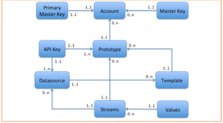

# Datavenue Overview

For a more "in depth" presentation, please refer to the Datavenue documentation.

## Context

The Datavenue service has been designed to help IoT companies to develop services around the connected objects. For this, Datavenue  helps to centralize data produced by different devices on the same platform, accessible from the Internet via APIs.

The aim is to assist IoT developers by offering a centralized storage, and all the helpful APIs to access the data

## Service access

The service is accessible from the internet. 
Access URL is: https://datavenue.orange.com/api/v1

Access to the API Datavenue is secured by [Orange Partner](https://www.orangepartner.com). You must previously subscribe to Orange Partner (sign up [here](https://www.orangepartner.com/user/register)) to obtain an authorization id. This id (named ClientID in the iOS SDK) will be used for all API requests.

## Resource model

The following diagram defines Datavenue resource model with its main entities. The relationships between these entities are specified (UML convention).

### Account

An account contains :
- informations related to the user (name, email, etc.),  
- a single  `Primary Master Key` allowing to modify the account,
- multiple `Master Keys` allowing to modify all the Prototypes, Templates and Datasources related to the account.

### Prototype

A Prototype is identical to a Datasource but is intented for prototyping purposes. Once a given Prototype is in a stable state, it can be saved as a Template.

### Template

A Template is a snapshot of the struture (Streams and Keys) of a Prototype at a given time. It cannot be modified once created, only deleted. It is intended to be used as a model to create new Datasources quickly with a predefined structure.

### Datasource

A Datasource can be either created empty or created from an existing Template.

Every datasource have their own set of Streams and API Keys.
A datasource also stores some informations like a unique name, a description, a location and has a generic metadata field to store custom data.

A Datasource is intented to represent a single IoT device, like a thermal sensor that could send its temperatures measure to Datavenue to a given Stream using a given API Key.

### Stream

A Stream is a set of values of the same type.
Each Steam can be described by its name, description, a unit (symbol and name).

A Stream is intended to represent a type of data that an IoT device can upload to Datavenue, like the temperature data of a thermal sensor. 

### Value

A Value can be of any type (string, numeric or JSON data). Each value can be associted with a timestamp (that defaults to the server's current time), a location and some custom metadata.

## Keys

The keys are used for authentication and resources access management. 
There are 3 types of keys that can be used to make calls on the Datavenue API:

- `Primary Master Key`: this is the key to manageme your account. This key is created during account creation on the Datavenue. It cannot be created with the SDK. But it can be used in the SDK, for example, to list the customer account information and create Master keys.

- `Master Key`: these keys give access to all the customer's datasources. They can be created using the Datavenue portal or the SDK. The master keys are used to manage all the resources (prototype, templates, datasources, streams, values). They are also used to manage the API keys.

- `API Key`: these keys have the most restricted scope and are used to access and manage a single Datasource or Prototype in particular. They are created using either the portal Datavenue or using the SDK.

### Key rights

Master Keys and API Keys can restrict the type of operations they can handle. This allows to create write-only keys (e.g for device uploading sensor data) and read-only keys (e.g. for a monitoring application). The rights are based on the REST verbs :

- `GET`: Read only access to a resource
- `POST`: Creation of a new resource (e.g. create new Datasources, or upload data to a Stream)
- `UPDATE`: Update an existing ressource (e.g. update the location of a Datasource)
- `DELETE`: Delete a ressource (e.g. remove some values from a Stream)

All these rights can be combined at the Account (with Master Keys) or Datasource (with API Keys) levels to create a powerful and fine-grained rights management system for your IoT application.

### Key regeneration

All keys can be revoked simply by regenerating them at any time.
Note that only the `Primary Master Key` can revoke itself or `Master Keys` and only the `Master Keys` can revoke `API Keys`.

# iOS SDK Overview

## ClientID and keys

The library needs two access keys in order to be allowed to make requests to the Datavenue API:

 - a `CliendID` which is available from the Orange Partner website.
 - a `key` (one of `Primary Master Key`, `Master Key` or `API Key`) which you can access from the Datavenue account page.

It is the application responsability to store these `ClientID` and `key` in a secure way.

## Asynchronous requests

All resources access are asynchronous and require a completion handler to be provided to track the completion of the request.

## Completion handlers

All completion handlers are called from a background queue. Your code is responsible of making sure you code will run on the main thread if the UI must be updated.

Example :

    let client = DVClient(clientID:"sdqfsdf" key:"DMLKDF")
    client.datasourcesWithParams(nil) { (datasources, error) in
        dispatch_async(dispatch_get_main_queue()) {
            // Make UI calls here
	    }
    }

## Request parameters

All requests that return a list of resources (like prototypes, templates, datasources, keys, streams and values) take an optional  `NSDictionary *` of `NSString *`.
Here is the list of the supported options :

 - `pagesize`: the number of returned elements (default: 10)
 - `pagenumber`: the number of the page (default: 0)
 - `search`: filter elements to match a query (more in next section).

Example:

    client.datasourcesWithParams(["pagenumber": 0, "pagesize":100]) { (datasources, error) in
    }

## Search query

 The search option allows to filter the elements by matching a value in the elements fields. It supports two operators : equality `=` and inequality `!=`. The fields are `name`, `description`,`metadata`.  By default the matched text is a substring of the value, but `%` operator can be used to indicate line matching :
 
 - `%ABC` : Matche all values starting with "ABC", like "ABCDEF".
 - `ABC%`: Matches all values ending with "ABC", like "DEADABC".
 - `%ABC%`: Matched all values containing exactly "ABC".

Example:

    // Return all datasources with names that do not start with "temp"
    client.datasourcesWithParams(["search": "name!=%temp"]) { (datasources, error) in
        // handle results
    }
